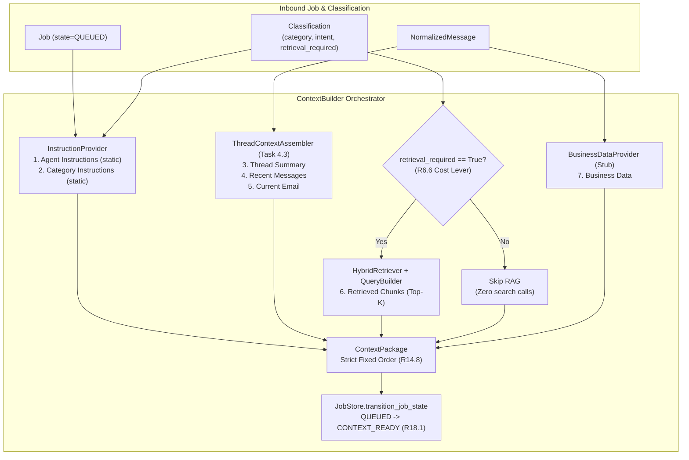

# Context Builder Orchestration (Task 4.4) Implementation Plan

> **For agentic workers:** REQUIRED SUB-SKILL: Use superpowers:subagent-driven-development to implement this plan task-by-task. Steps use checkbox (`- [ ]`) syntax for tracking.

**Goal:** Implement the Context Builder orchestrator that gathers thread context, business data (stubbed until Phase 5), and conditionally invokes hybrid RAG only when `retrieval_required=True` ([R6.6](file:///home/ple/Documents/antigravity/dazzling-bose/specs/requirements.md#L162)), emits a [`ContextPackage`](file:///home/ple/Documents/antigravity/dazzling-bose/packages/domain/entities.py#L152) in strictly fixed order with static sections first for prompt-prefix caching ([R14.8](file:///home/ple/Documents/antigravity/dazzling-bose/specs/requirements.md#L291), [design.md §5.4](file:///home/ple/Documents/antigravity/dazzling-bose/specs/design.md#L364)), and transitions the processing job `QUEUED → CONTEXT_READY` ([R18.1](file:///home/ple/Documents/antigravity/dazzling-bose/specs/requirements.md#L343)).

**Architecture:** The `packages/context` package introduces [`ContextBuilder`](file:///home/ple/Documents/antigravity/dazzling-bose/packages/context/builder.py), [`BusinessDataProvider`](file:///home/ple/Documents/antigravity/dazzling-bose/packages/context/builder.py), and [`InstructionProvider`](file:///home/ple/Documents/antigravity/dazzling-bose/packages/context/builder.py). When an actionable email job arrives in state `QUEUED`, `ContextBuilder`:
1. Resolves static agent and category instructions from the instruction provider (cacheable prefix).
2. Assembles thread conversation context via [`ThreadContextAssembler`](file:///home/ple/Documents/antigravity/dazzling-bose/packages/context/assembly.py#L154).
3. If `classification.retrieval_required == True`, builds a [`RetrievalQuery`](file:///home/ple/Documents/antigravity/dazzling-bose/packages/retrieval/models.py#L24) via [`RetrievalQueryBuilder`](file:///home/ple/Documents/antigravity/dazzling-bose/packages/retrieval/query_builder.py#L77) and queries [`HybridRetriever`](file:///home/ple/Documents/antigravity/dazzling-bose/packages/retrieval/retriever.py#L57); otherwise skips RAG entirely (0 search calls).
4. Fetches transactional facts from [`BusinessDataProvider`](file:///home/ple/Documents/antigravity/dazzling-bose/packages/context/builder.py) (stub until Phase 5).
5. Emits `ContextPackage` with fixed 7-section assembly order.
6. Atomically transitions `QUEUED → CONTEXT_READY` on [`JobStore`](file:///home/ple/Documents/antigravity/dazzling-bose/packages/db/job.py#L88).

**Architecture Diagram:**

**Tech Stack:** Python 3.12, asyncpg, `ThreadContextAssembler`, `RetrievalQueryBuilder`, `HybridRetriever`, `JobStore`, `ContextPackage`, pytest, pytest-asyncio, ruff, mypy.

**Spec:**
- Acceptance Contract: [`specs/requirements.md`](file:///home/ple/Documents/antigravity/dazzling-bose/specs/requirements.md) criteria `R14.8`, `R6.6`, `R18.1`.
- Blueprint Architecture: [`specs/design.md`](file:///home/ple/Documents/antigravity/dazzling-bose/specs/design.md) §5.4 (lines 362–386), §8.
- Technical Proposal: [`docs/proposal/Technical Proposal — Enterprise RAG-Based Intelligent Email Management and Response System.md`](file:///home/ple/Documents/antigravity/dazzling-bose/docs/proposal/Technical%20Proposal%20%E2%80%94%20Enterprise%20RAG-Based%20Intelligent%20Email%20Management%20and%20Response%20System.md) §21 & §46 (lines 969–977, 2147–2153).
- Work Queue: [`specs/tasks.md`](file:///home/ple/Documents/antigravity/dazzling-bose/specs/tasks.md) Task 4.4.

## Global Constraints

- **Fixed Assembly Order:** Prompt sections MUST follow the strict 7-part sequence from `design.md §5.4`: `agent_instructions → category_instructions → thread_summary → recent_messages → current_email → retrieved_knowledge → business_data`. Static sections first for prefix caching.
- **R6.6 Cost Lever:** When `retrieval_required == False`, hybrid retrieval MUST NOT be invoked under any circumstances.
- **State Transition Invariant:** State transitions go through `JobState` enum and `JobStore.transition_job_state()`, atomically recording `ProcessingEvent` (R18.1, R18.4). Never hand-write state strings.
- **Layering Rule:** `packages/context` imports `packages/{domain,core,db,llm,knowledge,retrieval,observability}` only, never `services/*`.
- **Multi-Tenant Scoping:** Every operation carries `organization_id`.

---

### Task 1: Business and Instruction Provider Interfaces

**Files:**
- Create: [`packages/context/builder.py`](file:///home/ple/Documents/antigravity/dazzling-bose/packages/context/builder.py)
- Test: [`tests/unit/test_context_builder.py`](file:///home/ple/Documents/antigravity/dazzling-bose/tests/unit/test_context_builder.py)

**Interfaces:**
- `BusinessDataProvider` Protocol:
  `async def get_business_data(self, organization_id: UUID | str, message: NormalizedMessage, intent: str | None = None) -> dict[str, Any]`
- `StubBusinessDataProvider`: Default implementation returning `{}` or structured mock data.
- `InstructionProvider` Protocol:
  `def get_instructions(self, category: str) -> tuple[str, str]`
- `DefaultInstructionProvider`: Returns static cacheable instructions for `billing`, `support`, `sales`, etc.

- [ ] **Step 1: Write the failing test for providers**
- [ ] **Step 2: Run test to verify it fails**
- [ ] **Step 3: Implement provider protocols and default classes in `packages/context/builder.py`**
- [ ] **Step 4: Run test to verify it passes**
- [ ] **Step 5: Commit**

---

### Task 2: Implement `ContextBuilder` Orchestration

**Files:**
- Modify: [`packages/context/builder.py`](file:///home/ple/Documents/antigravity/dazzling-bose/packages/context/builder.py)
- Modify: [`packages/context/__init__.py`](file:///home/ple/Documents/antigravity/dazzling-bose/packages/context/__init__.py)
- Test: [`tests/unit/test_context_builder.py`](file:///home/ple/Documents/antigravity/dazzling-bose/tests/unit/test_context_builder.py)

**Interfaces:**
- `ContextBuilder`:
  - `__init__(thread_assembler: ThreadContextAssembler, retriever: HybridRetriever | None = None, query_builder: RetrievalQueryBuilder | None = None, business_data_provider: BusinessDataProvider | None = None, instruction_provider: InstructionProvider | None = None, job_store: JobStore | None = None, top_k: int = 5)`
  - `async def build_context(self, job: Job, message: NormalizedMessage, classification: Classification | None = None, thread_messages: list[NormalizedMessage] | None = None, thread_state: ThreadState | None = None) -> ContextPackage`

- [ ] **Step 1: Write failing unit tests in `tests/unit/test_context_builder.py`**
  - `test_build_context_with_retrieval_required_true`: asserts RAG is invoked, query is constructed with thread summary, top-K chunks are attached, and sections are in exact order.
  - `test_build_context_with_retrieval_required_false_skips_rag`: asserts `retriever` is never called when `retrieval_required=False` (R6.6).
  - `test_build_context_transitions_job_state_queued_to_context_ready`: asserts `job_store.transition_job_state` is executed, transitioning job state to `CONTEXT_READY` (R18.1).
  - `test_build_context_fixed_assembly_order`: asserts `ContextPackage.get_ordered_sections()` yields the exact 7 ordered sections with static instructions first (R14.8).
- [ ] **Step 2: Run test to verify it fails**
- [ ] **Step 3: Implement `ContextBuilder.build_context` in `packages/context/builder.py`**
- [ ] **Step 4: Run test to verify it passes**
- [ ] **Step 5: Commit**

---

### Task 3: PostgreSQL Integration Test for Context Builder

**Files:**
- Create: [`tests/integration/test_context_builder_postgres.py`](file:///home/ple/Documents/antigravity/dazzling-bose/tests/integration/test_context_builder_postgres.py)

**Interfaces:**
- End-to-end integration test with live PostgreSQL:
  - Seeds organization, mailbox, email thread, and 3 messages.
  - Seeds knowledge document & chunks with pgvector embeddings and FTS.
  - Creates a `Job` in state `QUEUED` in PostgreSQL `job` table.
  - Executes `ContextBuilder.build_context()`.
  - Verifies:
    1. Job row in PostgreSQL transitioned `QUEUED → CONTEXT_READY` with `processing_event` recorded.
    2. Context package contains static instructions, thread summary, recent messages, current email, and retrieved knowledge chunks.
    3. Multi-tenant isolation is preserved.

- [ ] **Step 1: Write integration test `tests/integration/test_context_builder_postgres.py`**
- [ ] **Step 2: Run test against live PostgreSQL DB**
- [ ] **Step 3: Commit**

---

### Task 4: Quality Gate, Documentation, and Task Completion

**Files:**
- Modify: [`specs/tasks.md:395-400`](file:///home/ple/Documents/antigravity/dazzling-bose/specs/tasks.md)

- [ ] **Step 1: Run comprehensive tests and linting (`ruff`, `mypy`)**
- [ ] **Step 2: Mark Task 4.4 as `[x]` in `specs/tasks.md`**
- [ ] **Step 3: Commit final task completion**
