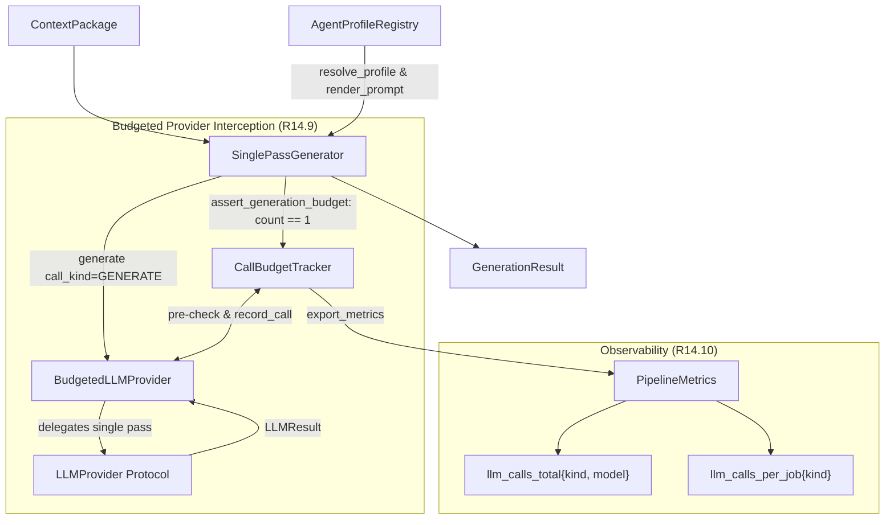

# Single-Pass Generation Path & Call Budget Implementation Plan

> **For agentic workers:** REQUIRED SUB-SKILL: Use superpowers:subagent-driven-development to implement this plan task-by-task. Steps use checkbox (`- [ ]`) syntax for tracking.

**Goal:** Implement single-pass generation orchestration and strict per-job model call budget tracking (`≤1 triage + ≤1 summarization + exactly 1 generation + ≤1 repair`, ceiling 4, common case 1) with `BudgetedLLMProvider` interception and Prometheus metrics export.

**Architecture:** A `CallBudgetTracker` maintains per-job model invocation counts by kind (`triage`, `summarize`, `generate`, `repair`), enforcing non-negotiable budget bounds and asserting exactly one generation call per job. A `BudgetedLLMProvider` decorator wraps any `LLMProvider`, intercepting `.generate()` calls to check limits before dispatch and record usage after completion. `SinglePassGenerator` orchestrates single-pass draft synthesis directly from `ContextPackage` via `AgentProfileRegistry` without multi-agent chaining (planner/critic/writer), with tier escalation replacing the generation call rather than adding one. On completion, metrics are exported to Prometheus (`llm_calls_total{kind, model}` and `llm_calls_per_job{kind}`).

**Architecture Diagram:**



**Tech Stack:** Python 3.12, Pydantic V2, Prometheus Client, Asyncio, Jinja2.

**Spec:** [`specs/tasks.md` Task 4.7](file:///home/ple/Documents/antigravity/dazzling-bose/specs/tasks.md#L413), [`specs/requirements.md` R14.3, R14.4, R14.9, R14.10](file:///home/ple/Documents/antigravity/dazzling-bose/specs/requirements.md#L286-L293), [`specs/design.md` §5.7](file:///home/ple/Documents/antigravity/dazzling-bose/specs/design.md#L536-L620).

## Global Constraints

- Exactly **one generation call** per job for normal emails; no chained planner/critic/writer agent pipeline (`R14.3`, `R14.4`).
- Strict budget invariants (`R14.9`): `≤1 triage + ≤1 summarization + exactly 1 generation + ≤1 repair` (ceiling 4, common case 1). Any additional call is a defect.
- Tier escalation **replaces** the generation call; it never adds one (`R15.5`, `design.md §5.7`).
- All calls pass through `BudgetedLLMProvider` or `CallBudgetTracker` enforcement.
- Export Prometheus counter `llm_calls_total{kind, model}` and histogram `llm_calls_per_job{kind}` (`R14.10`).
- No live network calls in tests; all tests use `FakeLLMProvider` or `StubLLMProvider` (`GEMINI.md §8`).
- All code formatted with `ruff format`, linted with `ruff check`, and strictly typed with `mypy`.

---

### Task 1: CallBudgetTracker, BudgetedLLMProvider & Invariants (`packages/llm/budget.py`)

**Files:**
- Create: `packages/llm/budget.py`
- Modify: `packages/llm/__init__.py:1-40`
- Test: `tests/unit/test_call_budget.py`

**Interfaces:**
- Consumes: `packages.llm.protocol.LLMProvider`, `packages.llm.protocol.LLMResult`, `packages.llm.protocol.ModelTier`, `packages.llm.protocol.ChatMessage`, `packages.llm.protocol.LLMError`, `packages.observability.metrics.PipelineMetrics`
- Produces: `CallKind`, `CallRecord`, `CallBudgetTracker`, `BudgetedLLMProvider`, `CallBudgetExceededError`, `CallBudgetViolationError`

- [ ] **Step 1: Write the failing tests for budget tracker and BudgetedLLMProvider**

Create `tests/unit/test_call_budget.py` covering:
- Permitted common case: 1 generate call through `BudgetedLLMProvider`.
- Permitted ceiling case: 1 triage + 1 summarize + 1 generate + 1 repair = 4 calls.
- Invariant violations:
  - 2nd generate call raises `CallBudgetExceededError`.
  - 2nd triage call raises `CallBudgetExceededError`.
  - 2nd summarize call raises `CallBudgetExceededError`.
  - 2nd repair call raises `CallBudgetExceededError`.
  - 5th call across all kinds raises `CallBudgetExceededError`.
  - Finalizing an AI generation job with 0 generate calls raises `CallBudgetViolationError`.
- Escalation replacement: verify generation tier update without incrementing generation count.

- [ ] **Step 2: Run test to verify it fails**

Run: `uv run pytest tests/unit/test_call_budget.py -v`
Expected: FAIL with "ModuleNotFoundError: No module named 'packages.llm.budget'".

- [ ] **Step 3: Implement CallBudgetTracker and BudgetedLLMProvider**

Implement `packages/llm/budget.py`:
- `CallKind(StrEnum)`: `TRIAGE = "triage"`, `SUMMARIZE = "summarize"`, `GENERATE = "generate"`, `REPAIR = "repair"`
- `CallRecord(frozen=True)`: `kind: CallKind`, `model: str`, `tier: str`, `tokens_in: int`, `tokens_out: int`, `timestamp: float`
- `CallBudgetExceededError(LLMError)` and `CallBudgetViolationError(LLMError)`
- `CallBudgetTracker`:
  - `MAX_TRIAGE = 1`, `MAX_SUMMARIZE = 1`, `MAX_GENERATE = 1`, `MAX_REPAIR = 1`, `BUDGET_CEILING = 4`
  - `check_can_call(kind: CallKind) -> None`
  - `record_call(kind: CallKind, model: str = "", tier: str = "", tokens_in: int = 0, tokens_out: int = 0) -> CallRecord`
  - `assert_generation_budget(require_generation: bool = True) -> None`
  - `get_counts() -> dict[str, int]`
  - `export_metrics(metrics: PipelineMetrics) -> None`
- `BudgetedLLMProvider(LLMProvider)`:
  - Wraps inner `LLMProvider`
  - `async def generate(self, *, messages, schema=None, tier=ModelTier.FAST, call_kind: CallKind = CallKind.GENERATE, **params) -> LLMResult`
  - Executes `self.tracker.check_can_call(call_kind)` before inner `generate`
  - Executes `self.tracker.record_call(call_kind, model=result.model, tier=result.tier, ...)`
  - Returns `result`
- Re-export in `packages/llm/__init__.py`.

- [ ] **Step 4: Run test to verify it passes**

Run: `uv run pytest tests/unit/test_call_budget.py -v`
Expected: PASS with 100% assertions satisfied.

- [ ] **Step 5: Commit**

```bash
git add packages/llm/budget.py packages/llm/__init__.py tests/unit/test_call_budget.py
git commit -m "feat(llm): implement CallBudgetTracker, BudgetedLLMProvider, and invariants [task 4.7] [R14.9]"
```

---

### Task 2: Observability Metric Alignment (`packages/observability/metrics.py`)

**Files:**
- Modify: `packages/observability/metrics.py:270-277`
- Test: `tests/unit/test_observability_metrics.py`

**Interfaces:**
- Consumes: `prometheus_client.Histogram`
- Produces: `PipelineMetrics.llm_calls_per_job` labeled by `kind` (`triage`, `summarize`, `generate`, `repair`, `total`)

- [ ] **Step 1: Write the failing test for labeled `llm_calls_per_job`**

Add test in `tests/unit/test_observability_metrics.py`:
- Test that `m.llm_calls_per_job.labels(kind="generate").observe(1)` succeeds.
- Test that observing kinds `triage`, `summarize`, `repair`, and `total` works without label errors.

- [ ] **Step 2: Run test to verify it fails**

Run: `uv run pytest tests/unit/test_observability_metrics.py -k test_llm_calls_per_job_labels -v`
Expected: FAIL because `llm_calls_per_job` does not currently take labels.

- [ ] **Step 3: Update `llm_calls_per_job` in `packages/observability/metrics.py`**

Update `packages/observability/metrics.py:271`:
```python
        llm_calls_per_job=Histogram(
            "llm_calls_per_job",
            "Distribution of LLM calls made for a single job execution",
            ["kind"],
            buckets=CALLS_PER_JOB_BUCKETS,
            registry=reg,
        ),
```

- [ ] **Step 4: Run test to verify it passes**

Run: `uv run pytest tests/unit/test_observability_metrics.py -v`
Expected: PASS.

- [ ] **Step 5: Commit**

```bash
git add packages/observability/metrics.py tests/unit/test_observability_metrics.py
git commit -m "feat(observability): add kind label to llm_calls_per_job histogram [task 4.7] [R14.10]"
```

---

### Task 3: SinglePassGenerator Orchestration (`packages/llm/generator.py`)

**Files:**
- Create: `packages/llm/generator.py`
- Modify: `packages/llm/__init__.py`
- Test: `tests/unit/test_single_pass_generator.py`

**Interfaces:**
- Consumes: `ContextPackage`, `AgentProfileRegistry`, `AgentProfile`, `LLMProvider`, `CallBudgetTracker`, `BudgetedLLMProvider`, `PipelineMetrics`
- Produces: `SinglePassGenerator`, `GenerationResult`

- [ ] **Step 1: Write the failing tests for SinglePassGenerator**

Create `tests/unit/test_single_pass_generator.py` covering:
- Single-pass generation: passes `ContextPackage`, renders versioned prompt (`R14.6`), invokes `BudgetedLLMProvider.generate` exactly once (`R14.3`, `R14.4`), validates output against profile schema.
- Rejection of multi-pass chains: verify single generation call per invocation.
- Escalation replacement: passing `escalated_tier=ModelTier.HIGH_CAPABILITY` uses high-capability tier for the single generation call; generate call count remains 1 (`R15.5`).
- Returns `GenerationResult` containing parsed content, prompt_version, tokens, model, tier, and budget summary.
- Budget tracking & metrics: verify `CallBudgetTracker` records the generate call and exports `llm_calls_total` and `llm_calls_per_job`.
- Error propagation: LLM errors properly handled while preserving recorded call counts.

- [ ] **Step 2: Run test to verify it fails**

Run: `uv run pytest tests/unit/test_single_pass_generator.py -v`
Expected: FAIL with "ModuleNotFoundError: No module named 'packages.llm.generator'".

- [ ] **Step 3: Implement SinglePassGenerator**

Implement `packages/llm/generator.py`:
- `GenerationResult` dataclass:
  - `content: dict[str, Any]`
  - `profile: AgentProfile`
  - `prompt_version: str`
  - `model: str`
  - `tier: ModelTier`
  - `escalation_reason: str | None`
  - `input_tokens: int`
  - `output_tokens: int`
  - `latency_ms: int`
  - `budget_tracker: CallBudgetTracker`
- `SinglePassGenerator`:
  - `__init__(llm_provider: LLMProvider, profile_registry: AgentProfileRegistry, metrics: PipelineMetrics | None = None)`
  - `async def generate_draft(...) -> GenerationResult`:
    - Resolve profile.
    - Tier selection (`escalated_tier or profile.model_tier`).
    - Render prompt via `AgentProfileRegistry.render_prompt(profile, context)`.
    - Fetch output schema via `AgentProfileRegistry.get_schema(profile)`.
    - Instantiate or use provided `CallBudgetTracker`.
    - Wrap or call via `BudgetedLLMProvider` with `call_kind=CallKind.GENERATE`.
    - Execute single generation call.
    - `budget_tracker.assert_generation_budget(require_generation=True)`.
    - Record metrics (`llm_calls_total`, `generation_latency_ms`, tokens, `tracker.export_metrics(metrics)`).
    - Return `GenerationResult` with `prompt_version=profile.prompt_version`.
- Re-export in `packages/llm/__init__.py`.

- [ ] **Step 4: Run test to verify it passes**

Run: `uv run pytest tests/unit/test_single_pass_generator.py -v`
Expected: PASS.

- [ ] **Step 5: Commit**

```bash
git add packages/llm/generator.py packages/llm/__init__.py tests/unit/test_single_pass_generator.py
git commit -m "feat(llm): implement SinglePassGenerator draft synthesis [task 4.7] [R14.3, R14.4, R14.6]"
```

---

### Task 4: Full Budget & Generation Test Suite & Quality Gate

**Files:**
- Create: `tests/unit/test_generation_budget.py`
- Modify: `specs/tasks.md:413-419`
- Artifact: `walkthrough.md`

**Interfaces:**
- Consumes: All components from Tasks 1–3, plus `ContextBuilder`
- Produces: Complete proof of `R14.3`, `R14.4`, `R14.9`, `R14.10`

- [ ] **Step 1: Write comprehensive end-to-end unit tests**

In `tests/unit/test_generation_budget.py`:
- Test 1: Full pipeline budget lifecycle simulation (triage LLM fallback [1] -> thread summarizer [1] -> context builder -> single-pass generator [1] -> schema repair [1] = 4 calls total). Passes cleanly.
- Test 2: Invariant enforcement — attempting 2nd generation call fails with `CallBudgetExceededError`.
- Test 3: Invariant enforcement — attempting 5th call fails with `CallBudgetExceededError`.
- Test 4: Escalation replacement — escalated tier replaces generation call without extra call.
- Test 5: Metrics validation — `llm_calls_total` and `llm_calls_per_job` histogram correctly incremented and observed.
- Test 6: End-to-end with real `ContextPackage` from `ContextBuilder` and `FakeLLMProvider`.

- [ ] **Step 2: Run all unit and contract tests**

Run: `uv run pytest tests/unit/test_call_budget.py tests/unit/test_single_pass_generator.py tests/unit/test_generation_budget.py -v`
Expected: All tests PASS.

- [ ] **Step 3: Run linters, formatters, and type checker**

Run:
```bash
uv run ruff check packages/llm tests/unit/test_call_budget.py tests/unit/test_single_pass_generator.py tests/unit/test_generation_budget.py
uv run ruff format --check packages/llm tests/unit/test_call_budget.py tests/unit/test_single_pass_generator.py tests/unit/test_generation_budget.py
uv run mypy packages/llm tests/unit/test_call_budget.py tests/unit/test_single_pass_generator.py tests/unit/test_generation_budget.py
```
Expected: 0 errors across all tools.

- [ ] **Step 4: Update `specs/tasks.md` and commit**

Mark Task 4.7 as complete `[x]` in `specs/tasks.md`.
```bash
git add specs/tasks.md tests/unit/test_generation_budget.py
git commit -m "feat(llm): complete single-pass generation path and call budget [task 4.7] [R14.3, R14.4, R14.9, R14.10]"
```
