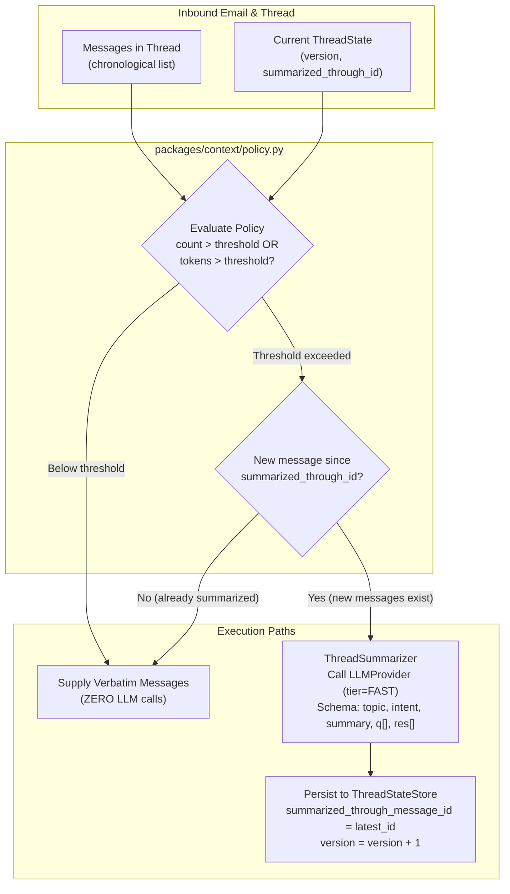

# Thread Summarization Policy (Task 4.2) Implementation Plan

> **For agentic workers:** REQUIRED SUB-SKILL: Use superpowers:subagent-driven-development to implement this plan task-by-task. Steps use checkbox (`- [ ]`) syntax for tracking.

**Goal:** Implement threshold-triggered conversation summarization that supplies verbatim messages when below configured thresholds, triggers LLM summarization when thresholds are exceeded, records `summarized_through_message_id`, and avoids regenerating summaries on every message ([R8.2](file:///home/ple/Documents/antigravity/dazzling-bose/specs/requirements.md#L193), [R8.3](file:///home/ple/Documents/antigravity/dazzling-bose/specs/requirements.md#L194), [R8.4](file:///home/ple/Documents/antigravity/dazzling-bose/specs/requirements.md#L195)).

**Architecture:** The `packages/context` package introduces [`SummarizationPolicy`](file:///home/ple/Documents/antigravity/dazzling-bose/packages/context/policy.py) and [`ThreadSummarizer`](file:///home/ple/Documents/antigravity/dazzling-bose/packages/context/summarizer.py). The policy evaluates thread message count and estimated context tokens against [`SummarizationSettings`](file:///home/ple/Documents/antigravity/dazzling-bose/packages/core/settings.py#L252). If below threshold, verbatim messages are retained with zero LLM calls. If threshold is exceeded and new messages exist since `summarized_through_message_id`, a structured summary is generated via [`LLMProvider`](file:///home/ple/Documents/antigravity/dazzling-bose/packages/llm/protocol.py#L48) (tier `FAST`), persisting updated `topic`, `intent`, `summary`, `open_questions`, `resolved_items`, and `summarized_through_message_id` to [`ThreadStateStore`](file:///home/ple/Documents/antigravity/dazzling-bose/packages/db/thread_state.py#L93) under optimistic concurrency control.

**Architecture Diagram:**



**Tech Stack:** Python 3.12, pydantic, asyncpg, tiktoken (via `TokenCounter`), `LLMProvider`, `ThreadStateStore`, pytest, pytest-asyncio, ruff, mypy.

**Spec:**
- Acceptance Contract: [`specs/requirements.md`](file:///home/ple/Documents/antigravity/dazzling-bose/specs/requirements.md) criteria `R8.2`, `R8.3`, `R8.4`.
- Blueprint Architecture: [`specs/design.md`](file:///home/ple/Documents/antigravity/dazzling-bose/specs/design.md) §5.4 (lines 378–388), §5.7.
- Work Queue: [`specs/tasks.md`](file:///home/ple/Documents/antigravity/dazzling-bose/specs/tasks.md) Task 4.2.

## Global Constraints

- **Single Generation Invariant:** Thread summarization uses `tier=ModelTier.FAST` and occurs only when triggered by thresholds; it does NOT count as the job's single draft generation call (design.md §5.7).
- **Cost Invariant:** Threads below threshold MUST trigger zero LLM calls (asserted in tests per Task 4.2).
- **No Per-Message Regeneration:** Summarization must NOT run on every message; it must record and check `summarized_through_message_id`.
- **Tenant Scoping:** All reads/writes on `thread_state` must carry `organization_id`.
- **Layering Rule:** `packages/context` imports `packages/{domain,core,db,llm,knowledge,observability}` only, never `services/*`.

---

### Task 1: Policy Data Structures & Threshold Evaluator in `packages/context/policy.py`

**Files:**
- Create: [`packages/context/__init__.py`](file:///home/ple/Documents/antigravity/dazzling-bose/packages/context/__init__.py)
- Create: [`packages/context/policy.py`](file:///home/ple/Documents/antigravity/dazzling-bose/packages/context/policy.py)
- Test: [`tests/unit/test_summarization_policy.py`](file:///home/ple/Documents/antigravity/dazzling-bose/tests/unit/test_summarization_policy.py)

**Interfaces:**
- Consumes: `NormalizedMessage`, `ThreadState`, `SummarizationSettings`, `TokenCounter`.
- Produces: `SummarizationDecision`, `SummarizationPolicy`, `THREAD_SUMMARY_SCHEMA`.

- [ ] **Step 1: Write failing unit test for `SummarizationPolicy` threshold evaluation**

```python
# tests/unit/test_summarization_policy.py
from datetime import UTC, datetime
from uuid import uuid4
import pytest

from packages.core.settings import SummarizationSettings
from packages.domain.entities import EmailAddress, NormalizedMessage, ThreadState
from packages.context.policy import SummarizationPolicy


def make_msg(idx: int, thread_id, org_id, body: str = "Test body") -> NormalizedMessage:
    return NormalizedMessage(
        message_id=uuid4(),
        thread_id=thread_id,
        mailbox_id=uuid4(),
        organization_id=org_id,
        provider="gmail",
        provider_message_id=f"msg-{idx}",
        sender=EmailAddress(email="user@example.com"),
        received_at=datetime.now(UTC),
        body_text_clean=body,
    )


def test_summarization_policy_short_thread_no_summary():
    """Verify that short thread below thresholds does not trigger summarization (R8.2)."""
    settings = SummarizationSettings(min_messages_threshold=4, context_token_threshold=1500)
    policy = SummarizationPolicy(settings)
    thread_id, org_id = uuid4(), uuid4()

    messages = [make_msg(i, thread_id, org_id, "Short note") for i in range(2)]
    decision = policy.evaluate(messages=messages, current_state=None)

    assert not decision.should_summarize
    assert decision.reason == "below_threshold"


def test_summarization_policy_message_count_threshold_triggered():
    """Verify that exceeding min_messages_threshold triggers summarization (R8.3)."""
    settings = SummarizationSettings(min_messages_threshold=4, context_token_threshold=1500)
    policy = SummarizationPolicy(settings)
    thread_id, org_id = uuid4(), uuid4()

    messages = [make_msg(i, thread_id, org_id, "Short note") for i in range(5)]
    decision = policy.evaluate(messages=messages, current_state=None)

    assert decision.should_summarize
    assert decision.reason == "message_count_threshold_exceeded"


def test_summarization_policy_token_threshold_triggered():
    """Verify that exceeding token threshold triggers summarization (R8.3)."""
    settings = SummarizationSettings(min_messages_threshold=10, context_token_threshold=100)
    policy = SummarizationPolicy(settings)
    thread_id, org_id = uuid4(), uuid4()

    long_body = "This is a detailed paragraph with extensive explanations. " * 30
    messages = [make_msg(i, thread_id, org_id, long_body) for i in range(2)]
    decision = policy.evaluate(messages=messages, current_state=None)

    assert decision.should_summarize
    assert decision.reason == "token_threshold_exceeded"


def test_summarization_policy_already_summarized_skips_regeneration():
    """Verify that if already summarized through latest message, regeneration is skipped (R8.4)."""
    settings = SummarizationSettings(min_messages_threshold=3, context_token_threshold=1500)
    policy = SummarizationPolicy(settings)
    thread_id, org_id = uuid4(), uuid4()

    messages = [make_msg(i, thread_id, org_id, "Note") for i in range(5)]
    latest_id = messages[-1].message_id

    current_state = ThreadState(
        thread_id=thread_id,
        organization_id=org_id,
        summary="Existing summary",
        summarized_through_message_id=latest_id,
        version=1,
    )

    decision = policy.evaluate(messages=messages, current_state=current_state)
    assert not decision.should_summarize
    assert decision.reason == "already_summarized"
```

- [ ] **Step 2: Run test to verify it fails**

Run: `uv run pytest tests/unit/test_summarization_policy.py -v`
Expected: FAIL with `ModuleNotFoundError: No module named 'packages.context'`

- [ ] **Step 3: Implement `packages/context/policy.py` and `packages/context/__init__.py`**

Define:
- `SummarizationDecision`: dataclass holding `should_summarize: bool`, `reason: str`, `estimated_tokens: int`, `message_count: int`, `messages_to_summarize: list[NormalizedMessage]`.
- `THREAD_SUMMARY_SCHEMA`: JSON schema expecting `topic` (string), `current_intent` (string), `summary` (string), `open_questions` (array of strings), `resolved_items` (array of strings).
- `SummarizationPolicy`: class accepting `SummarizationSettings` and `TokenCounter`, providing `evaluate(messages, current_state) -> SummarizationDecision`.

- [ ] **Step 4: Run test to verify it passes**

Run: `uv run pytest tests/unit/test_summarization_policy.py -v`
Expected: PASS

- [ ] **Step 5: Commit**

```bash
git add packages/context/__init__.py packages/context/policy.py tests/unit/test_summarization_policy.py
git commit -m "feat(context): add SummarizationPolicy threshold evaluator [task 4.2] [R8.2, R8.3, R8.4]"
```

---

### Task 2: Implement `ThreadSummarizer` with `LLMProvider` & `ThreadStateStore`

**Files:**
- Create: [`packages/context/summarizer.py`](file:///home/ple/Documents/antigravity/dazzling-bose/packages/context/summarizer.py)
- Modify: [`packages/context/__init__.py`](file:///home/ple/Documents/antigravity/dazzling-bose/packages/context/__init__.py)
- Test: [`tests/unit/test_summarization_policy.py`](file:///home/ple/Documents/antigravity/dazzling-bose/tests/unit/test_summarization_policy.py)

**Interfaces:**
- Consumes: `LLMProvider`, `ThreadStateStore`, `SummarizationPolicy`, `TokenCounter`.
- Produces: `ThreadSummarizer` with `summarize_thread(organization_id, thread_id, messages, current_state) -> SummarizationResult`.

- [ ] **Step 1: Write failing unit test for `ThreadSummarizer` asserting zero LLM calls on short threads**

```python
# tests/unit/test_summarization_policy.py (additional tests)
from packages.context.summarizer import ThreadSummarizer
from packages.db.thread_state import InMemoryThreadStateStore
from packages.llm.fake import FakeLLMProvider


@pytest.mark.asyncio
async def test_summarizer_zero_llm_calls_on_short_thread():
    """Assert in tests that a short thread triggers zero summarization calls (Task 4.2, R8.2)."""
    settings = SummarizationSettings(min_messages_threshold=4, context_token_threshold=1500)
    fake_llm = FakeLLMProvider()
    store = InMemoryThreadStateStore()
    summarizer = ThreadSummarizer(llm=fake_llm, store=store, settings=settings)

    thread_id, org_id = uuid4(), uuid4()
    messages = [make_msg(i, thread_id, org_id, "Short note") for i in range(2)]

    result = await summarizer.summarize_thread(
        organization_id=org_id,
        thread_id=thread_id,
        messages=messages,
    )

    assert not result.summarized
    assert len(fake_llm.recorded_calls) == 0
    assert result.thread_state is None
    assert len(result.verbatim_messages) == 2


@pytest.mark.asyncio
async def test_summarizer_generates_and_persists_summary_on_threshold():
    """Verify that exceeding threshold triggers LLM call and persists thread_state (R8.3, R8.4)."""
    settings = SummarizationSettings(min_messages_threshold=3, context_token_threshold=1500)
    fake_llm = FakeLLMProvider(
        default_response={
            "topic": "Billing discrepancy",
            "current_intent": "refund_request",
            "summary": "Customer overcharged $20 and requested refund.",
            "open_questions": ["Receipt copy?"],
            "resolved_items": ["Customer ID verified"],
        }
    )
    store = InMemoryThreadStateStore()
    summarizer = ThreadSummarizer(llm=fake_llm, store=store, settings=settings)

    thread_id, org_id = uuid4(), uuid4()
    messages = [make_msg(i, thread_id, org_id, f"Message {i}") for i in range(4)]
    latest_id = messages[-1].message_id

    result = await summarizer.summarize_thread(
        organization_id=org_id,
        thread_id=thread_id,
        messages=messages,
    )

    assert result.summarized
    assert len(fake_llm.recorded_calls) == 1
    assert result.thread_state is not None
    assert result.thread_state.topic == "Billing discrepancy"
    assert result.thread_state.summarized_through_message_id == latest_id
    assert result.thread_state.version == 1

    # Verify persisted in store
    persisted = await store.get(org_id, thread_id)
    assert persisted is not None
    assert persisted.summary == "Customer overcharged $20 and requested refund."
    assert persisted.summarized_through_message_id == latest_id

    # Second call with same messages triggers NO additional LLM call (R8.4)
    second_result = await summarizer.summarize_thread(
        organization_id=org_id,
        thread_id=thread_id,
        messages=messages,
        current_state=persisted,
    )
    assert not second_result.summarized
    assert len(fake_llm.recorded_calls) == 1  # Still 1, no new call!
```

- [ ] **Step 2: Run test to verify it fails**

Run: `uv run pytest tests/unit/test_summarization_policy.py::test_summarizer_zero_llm_calls_on_short_thread -v`
Expected: FAIL with `ImportError: cannot import name 'ThreadSummarizer' from 'packages.context.summarizer'`

- [ ] **Step 3: Implement `ThreadSummarizer` in `packages/context/summarizer.py`**

Implementation details:
- Construct prompt with conversation messages.
- Call `self.llm.generate(messages=..., schema=THREAD_SUMMARY_SCHEMA, tier=ModelTier.FAST)`.
- Update `ThreadState` with `summarized_through_message_id = latest_message_id`.
- Persist state using `self.store.save(state)`.
- Return `SummarizationResult(summarized, thread_state, verbatim_messages, decision)`.

- [ ] **Step 4: Run unit tests to verify they pass**

Run: `uv run pytest tests/unit/test_summarization_policy.py -v`
Expected: PASS (all tests)

- [ ] **Step 5: Commit**

```bash
git add packages/context/summarizer.py packages/context/__init__.py tests/unit/test_summarization_policy.py
git commit -m "feat(context): implement ThreadSummarizer with threshold checks [task 4.2] [R8.2, R8.3, R8.4]"
```

---

### Task 3: Integration Tests with Live PostgreSQL Container

**Files:**
- Create: [`tests/integration/test_summarization_postgres.py`](file:///home/ple/Documents/antigravity/dazzling-bose/tests/integration/test_summarization_postgres.py)

**Interfaces:**
- Consumes: `PostgresThreadStateStore`, `FakeLLMProvider`, `ThreadSummarizer`, live PostgreSQL connection pool.
- Tests: Real database persistence of summarization updates, `summarized_through_message_id` recording, and version incrementing across multiple conversational turns.

- [ ] **Step 1: Write integration tests in `tests/integration/test_summarization_postgres.py`**

Test scenarios:
1. `test_postgres_summarization_lifecycle`:
   - Start with 2 messages -> run summarizer -> 0 LLM calls, no DB row.
   - Add 3 more messages (total 5 > threshold 4) -> run summarizer -> 1 LLM call, DB row created with `version=1` and `summarized_through_message_id = msg_5.id`.
   - Add 1 more message -> run summarizer -> 1 additional LLM call, DB row updated to `version=2` and `summarized_through_message_id = msg_6.id`.
   - Re-run on unchanged 6 messages -> 0 additional LLM calls, DB unchanged.

- [ ] **Step 2: Run integration tests against PostgreSQL container**

Run: `uv run pytest tests/integration/test_summarization_postgres.py -v`
Expected: PASS

- [ ] **Step 3: Commit**

```bash
git add tests/integration/test_summarization_postgres.py
git commit -m "test(context): add PostgreSQL integration test for summarization lifecycle [task 4.2] [R8.2, R8.3, R8.4]"
```

---

### Task 4: Verification, Linting & Task Completion

**Files:**
- Modify: [`specs/tasks.md`](file:///home/ple/Documents/antigravity/dazzling-bose/specs/tasks.md)

- [ ] **Step 1: Run full test suite and quality checks**

```bash
uv run pytest tests/unit/test_summarization_policy.py tests/integration/test_summarization_postgres.py -v
uv run ruff check .
uv run mypy packages/context
```
Expected: All tests pass, lint clean, type checks clean.

- [ ] **Step 2: Mark Task 4.2 as done in `specs/tasks.md`**

Update `- [ ] **4.2 Summarization policy**` to `- [x] **4.2 Summarization policy**`.

- [ ] **Step 3: Commit task completion**

```bash
git add specs/tasks.md
git commit -m "feat(context): complete summarization policy [task 4.2] [R8.2, R8.3, R8.4]"
```
