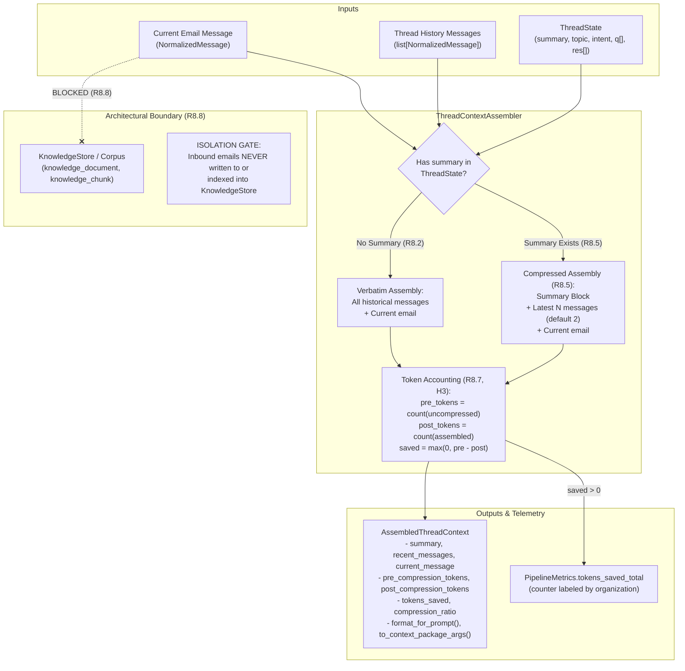

# Thread Context Assembly (Task 4.3) Implementation Plan

> **For agentic workers:** REQUIRED SUB-SKILL: Use superpowers:subagent-driven-development to implement this plan task-by-task. Steps use checkbox (`- [ ]`) syntax for tracking.

**Goal:** Implement thread context assembly that combines `summary + latest N relevant messages + current email` when a thread summary exists, supplies verbatim messages when no summary exists ([R8.5](file:///home/ple/Documents/antigravity/dazzling-bose/specs/requirements.md#L196)), computes and records tokens saved for hypothesis H3 ([R8.7](file:///home/ple/Documents/antigravity/dazzling-bose/specs/requirements.md#L198), [R22.5](file:///home/ple/Documents/antigravity/dazzling-bose/specs/requirements.md#L408)), and enforces that inbound email content remains strictly isolated within the thread subsystem away from the organizational knowledge corpus ([R8.8](file:///home/ple/Documents/antigravity/dazzling-bose/specs/requirements.md#L199)).

**Architecture:** The `packages/context` package introduces [`AssembledThreadContext`](file:///home/ple/Documents/antigravity/dazzling-bose/packages/context/assembly.py) and [`ThreadContextAssembler`](file:///home/ple/Documents/antigravity/dazzling-bose/packages/context/assembly.py). The assembler inspects the conversation's [`ThreadState`](file:///home/ple/Documents/antigravity/dazzling-bose/packages/domain/entities.py#L408) and historical [`NormalizedMessage`](file:///home/ple/Documents/antigravity/dazzling-bose/packages/domain/entities.py#L22) records. When a summary exists, it retains the summary block (topic, intent, summary, open questions, resolved items) plus the latest `N` messages (from [`SummarizationSettings.keep_latest_messages`](file:///home/ple/Documents/antigravity/dazzling-bose/packages/core/settings.py#L261), default 2) plus the current incoming email. If no summary exists, all historical messages are supplied verbatim. It estimates pre- and post-compression token counts using [`TokenCounter`](file:///home/ple/Documents/antigravity/dazzling-bose/packages/knowledge/token_counter.py#L19), computes `tokens_saved = max(0, pre - post)`, and records Prometheus metric `tokens_saved_total` in [`PipelineMetrics`](file:///home/ple/Documents/antigravity/dazzling-bose/packages/observability/metrics.py#L48).

**Architecture Diagram:**



**Tech Stack:** Python 3.12, asyncpg, tiktoken (via `TokenCounter`), `PipelineMetrics`, `SummarizationSettings`, `ThreadStateStore`, `MessageStore`, pytest, pytest-asyncio, ruff, mypy.

**Spec:**
- Acceptance Contract: [`specs/requirements.md`](file:///home/ple/Documents/antigravity/dazzling-bose/specs/requirements.md) criteria `R8.5`, `R8.7`, `R8.8`, `R22.5` (H3).
- Blueprint Architecture: [`specs/design.md`](file:///home/ple/Documents/antigravity/dazzling-bose/specs/design.md) §5.4 (lines 362–386), §5.7.
- Technical Proposal: [`docs/proposal/Technical Proposal — Enterprise RAG-Based Intelligent Email Management and Response System.md`](file:///home/ple/Documents/antigravity/dazzling-bose/docs/proposal/Technical%20Proposal%20%E2%80%94%20Enterprise%20RAG-Based%20Intelligent%20Email%20Management%20and%20Response%20System.md) §46 (lines 2147–2150, 2191–2208).
- Work Queue: [`specs/tasks.md`](file:///home/ple/Documents/antigravity/dazzling-bose/specs/tasks.md) Task 4.3.

## Global Constraints

- **Assembly Order:** Thread context supplies `summary + latest N relevant messages + current email` (R8.5).
- **H3 Telemetry:** Pre- and post-compression token counts and `tokens_saved` must be recorded and exported via `tokens_saved_total` counter (R8.7, R21.4).
- **Knowledge Boundary (R8.8):** Inbound emails belong exclusively to the thread subsystem (`email_message`, `email_thread`, `thread_state`) and must never be indexed into `knowledge_document` or `knowledge_chunk`.
- **Tenant Scoping:** All operations carry `organization_id`.
- **Layering Rule:** `packages/context` imports `packages/{domain,core,db,llm,knowledge,observability}` only, never `services/*`.

---

### Task 1: Add `tokens_saved_total` to `PipelineMetrics`

**Files:**
- Modify: [`packages/observability/metrics.py:70-74`](file:///home/ple/Documents/antigravity/dazzling-bose/packages/observability/metrics.py)
- Modify: [`packages/observability/metrics.py:220-225`](file:///home/ple/Documents/antigravity/dazzling-bose/packages/observability/metrics.py)
- Modify: [`tests/unit/test_observability_metrics.py:35-40`](file:///home/ple/Documents/antigravity/dazzling-bose/tests/unit/test_observability_metrics.py)

**Interfaces:**
- Produces: `PipelineMetrics.tokens_saved_total` counter labeled with `["organization"]`.

- [ ] **Step 1: Write the failing test for `tokens_saved_total`**

Update `tests/unit/test_observability_metrics.py`:
```python
def test_metrics_registry_initialization_all_r21_metrics() -> None:
    ...
    assert m.reaped_leases_total is not None
    assert m.tokens_saved_total is not None  # R8.7, H3
```

- [ ] **Step 2: Run test to verify it fails**

Run: `uv run pytest tests/unit/test_observability_metrics.py -k test_metrics_registry_initialization_all_r21_metrics -v`
Expected: FAIL with `AttributeError: 'PipelineMetrics' object has no attribute 'tokens_saved_total'`.

- [ ] **Step 3: Implement `tokens_saved_total` in `packages/observability/metrics.py`**

In `packages/observability/metrics.py`:
```python
@dataclass
class PipelineMetrics:
    ...
    reaped_leases_total: Counter
    tokens_saved_total: Counter  # R8.7, H3
```
And in `create_pipeline_metrics`:
```python
        reaped_leases_total=Counter(
            "reaped_leases_total",
            "Total stuck jobs reclaimed after lease expiration (R19.8)",
            ["action", "state"],
            registry=reg,
        ),
        tokens_saved_total=Counter(
            "tokens_saved_total",
            "Total prompt tokens saved via conversation summarization (R8.7, H3)",
            ["organization"],
            registry=reg,
        ),
```

- [ ] **Step 4: Run test to verify it passes**

Run: `uv run pytest tests/unit/test_observability_metrics.py -v`
Expected: PASS.

- [ ] **Step 5: Commit**

```bash
git add packages/observability/metrics.py tests/unit/test_observability_metrics.py
git commit -m "feat(observability): add tokens_saved_total metric for H3 [R8.7, R21.4]"
```

---

### Task 2: Implement `AssembledThreadContext` and `ThreadContextAssembler`

**Files:**
- Create: [`packages/context/assembly.py`](file:///home/ple/Documents/antigravity/dazzling-bose/packages/context/assembly.py)
- Modify: [`packages/context/__init__.py`](file:///home/ple/Documents/antigravity/dazzling-bose/packages/context/__init__.py)
- Test: [`tests/unit/test_thread_context_assembly.py`](file:///home/ple/Documents/antigravity/dazzling-bose/tests/unit/test_thread_context_assembly.py)

**Interfaces:**
- `AssembledThreadContext`:
  - `thread_id: UUID`
  - `organization_id: UUID`
  - `summary: str | None`
  - `topic: str | None`
  - `current_intent: str | None`
  - `open_questions: list[str]`
  - `resolved_items: list[str]`
  - `recent_messages: list[NormalizedMessage]`
  - `current_message: NormalizedMessage`
  - `has_summary: bool`
  - `pre_compression_tokens: int`
  - `post_compression_tokens: int`
  - `tokens_saved: int`
  - `compression_ratio: float`
  - `format_for_prompt() -> str`
  - `to_context_package_args() -> dict[str, Any]`
- `ThreadContextAssembler`:
  - `__init__(settings: SummarizationSettings, token_counter: TokenCounter | None = None, metrics: PipelineMetrics | None = None, thread_state_store: ThreadStateStore | None = None, message_store: MessageStore | None = None)`
  - `async assemble(organization_id: UUID | str, thread_id: UUID | str, current_message: NormalizedMessage, thread_messages: list[NormalizedMessage] | None = None, thread_state: ThreadState | None = None, keep_latest_messages: int | None = None) -> AssembledThreadContext`

- [ ] **Step 1: Write the failing tests in `tests/unit/test_thread_context_assembly.py`**

Test scenarios:
1. `test_assemble_short_thread_no_summary_verbatim_messages`: 2 historical messages, no summary -> `has_summary=False`, verbatim messages returned, `tokens_saved=0`.
2. `test_assemble_long_thread_with_summary_latest_n_messages`: 5 historical messages, summary exists -> `has_summary=True`, `summary + latest 2 messages + current email`, `tokens_saved > 0`, metric incremented.
3. `test_assemble_single_message_thread`: 0 historical messages -> `recent_messages=[]`, `tokens_saved=0`.
4. `test_assemble_format_for_prompt_and_context_package_args`: verifies structured formatting and dictionary conversion for `ContextPackage`.
5. `test_assemble_auto_fetch_from_stores`: passes `InMemoryThreadStateStore` and message list -> assembler fetches state automatically.

- [ ] **Step 2: Run test to verify it fails**

Run: `uv run pytest tests/unit/test_thread_context_assembly.py -v`
Expected: FAIL with `ModuleNotFoundError: No module named 'packages.context.assembly'`.

- [ ] **Step 3: Implement `packages/context/assembly.py` and update `packages/context/__init__.py`**

Implement complete `AssembledThreadContext` and `ThreadContextAssembler` with token accounting and metric emission.

- [ ] **Step 4: Run test to verify it passes**

Run: `uv run pytest tests/unit/test_thread_context_assembly.py -v`
Expected: PASS with 5 passed tests.

- [ ] **Step 5: Commit**

```bash
git add packages/context/assembly.py packages/context/__init__.py tests/unit/test_thread_context_assembly.py
git commit -m "feat(context): implement thread context assembly and token accounting [task 4.3] [R8.5, R8.7]"
```

---

### Task 3: Inbound Email Isolation & Boundary Verification (R8.8)

**Files:**
- Modify: [`tests/unit/test_thread_context_assembly.py`](file:///home/ple/Documents/antigravity/dazzling-bose/tests/unit/test_thread_context_assembly.py)

**Interfaces:**
- Asserts that inbound emails (`NormalizedMessage`) are isolated in the thread subsystem and cannot be ingested or stored into `KnowledgeStore` (`knowledge_document`, `knowledge_chunk`).
- Verifies hypothesis H3 evaluation support: measures token savings across a multi-message thread progression.

- [ ] **Step 1: Write test for R8.8 boundary isolation and H3 evaluation**

Add `test_inbound_email_strictly_isolated_from_knowledge_corpus` and `test_h3_token_savings_progression`.

- [ ] **Step 2: Run test to verify behavior**

Run: `uv run pytest tests/unit/test_thread_context_assembly.py -k "isolated or h3" -v`
Expected: PASS.

- [ ] **Step 3: Commit**

```bash
git add tests/unit/test_thread_context_assembly.py
git commit -m "test(context): verify inbound email knowledge boundary and H3 token savings [R8.8, R22.5]"
```

---

### Task 4: PostgreSQL Integration Tests for Thread Context Assembly

**Files:**
- Create: [`tests/integration/test_thread_context_assembly_postgres.py`](file:///home/ple/Documents/antigravity/dazzling-bose/tests/integration/test_thread_context_assembly_postgres.py)

**Interfaces:**
- Verifies `ThreadContextAssembler` integrated with `PostgresMessageStore` and `PostgresThreadStateStore` against live PostgreSQL container.
- Tests multi-message thread insertion, thread state persistence, and full context assembly.
- Asserts tenant isolation (`organization_id` scoping).

- [ ] **Step 1: Write integration test `tests/integration/test_thread_context_assembly_postgres.py`**

- [ ] **Step 2: Run test to verify it executes against live DB**

Run: `uv run pytest tests/integration/test_thread_context_assembly_postgres.py -v`
Expected: PASS.

- [ ] **Step 3: Commit**

```bash
git add tests/integration/test_thread_context_assembly_postgres.py
git commit -m "test(integration): verify thread context assembly against PostgreSQL [task 4.3] [R8.5, R8.7, R8.8]"
```

---

### Task 5: Quality Gate, Documentation, and Task Completion

**Files:**
- Modify: [`specs/tasks.md:389-393`](file:///home/ple/Documents/antigravity/dazzling-bose/specs/tasks.md)

- [ ] **Step 1: Run comprehensive tests and linting**

Run:
```bash
uv run pytest tests/unit/test_thread_context_assembly.py tests/integration/test_thread_context_assembly_postgres.py -v
uv run ruff check packages/context packages/observability tests/unit/test_thread_context_assembly.py tests/integration/test_thread_context_assembly_postgres.py
uv run mypy packages/context
```

- [ ] **Step 2: Mark Task 4.3 as `[x]` in `specs/tasks.md`**

- [ ] **Step 3: Commit final task completion**

```bash
git add specs/tasks.md
git commit -m "feat(context): complete thread context assembly [task 4.3] [R8.5, R8.7, R8.8]"
```
