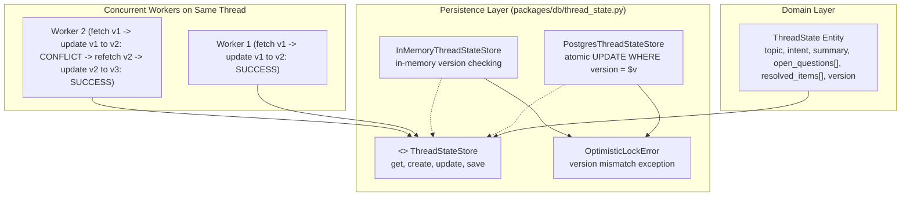

# Thread State Store (Task 4.1) Implementation Plan

> **For agentic workers:** REQUIRED SUB-SKILL: Use superpowers:subagent-driven-development to implement this plan task-by-task. Steps use checkbox (`- [ ]`) syntax for tracking.

**Goal:** Implement the persistent and in-memory `ThreadStateStore` supporting read/write operations for thread topic, intent, summary, open questions, and resolved items with optimistic concurrency on `version` to ensure zero lost updates across concurrent workers ([R8.1](file:///home/ple/Documents/antigravity/dazzling-bose/specs/requirements.md#L192), [R8.6](file:///home/ple/Documents/antigravity/dazzling-bose/specs/requirements.md#L197)).

**Architecture:** Domain dataclass [`ThreadState`](file:///home/ple/Documents/antigravity/dazzling-bose/packages/domain/entities.py) represents conversation state per email thread in `packages/domain/entities.py`. The persistence layer in `packages/db/thread_state.py` provides the `ThreadStateStore` protocol, implemented by `PostgresThreadStateStore` (backed by PostgreSQL `thread_state` table with atomic conditional updates `WHERE version = $expected_version`) and `InMemoryThreadStateStore` (for pure unit tests). Version collisions raise `OptimisticLockError`, allowing callers to retry without losing concurrent updates.

**Architecture Diagram:**



**Tech Stack:** Python 3.12, asyncpg, PostgreSQL with JSONB columns, pytest, pytest-asyncio, ruff, mypy.

**Spec:**
- Acceptance Contract: [`specs/requirements.md`](file:///home/ple/Documents/antigravity/dazzling-bose/specs/requirements.md) criteria `R8.1`, `R8.6`, `R5.2`.
- Blueprint Architecture: [`specs/design.md`](file:///home/ple/Documents/antigravity/dazzling-bose/specs/design.md) §6.1 (`thread_state` schema), §5.2.
- Source of Truth: [`docs/proposal/Technical Proposal — Enterprise RAG-Based Intelligent Email Management and Response System.md`](file:///home/ple/Documents/antigravity/dazzling-bose/docs/proposal/Technical%20Proposal%20%E2%80%94%20Enterprise%20RAG-Based%20Intelligent%20Email%20Management%20and%20Response%20System.md) line 480.
- Work Queue: [`specs/tasks.md`](file:///home/ple/Documents/antigravity/dazzling-bose/specs/tasks.md) Task 4.1.

## Global Constraints

- **Layering Rule:** `packages/domain` imports standard library and `packages/core` only; no database SDKs in domain.
- **Tenant Isolation:** Every query on `thread_state` MUST be scoped by `organization_id`.
- **Optimistic Concurrency:** Updates must condition on `version = expected_version` and atomically increment `version = version + 1`.
- **Zero Lost Updates:** Concurrent modifications to the same thread state must be detected and never silently overwrite another worker's committed state.
- **No Direct SQL in Services:** All database access must go through `ThreadStateStore`.

---

### Task 1: Domain Entity `ThreadState` in `packages/domain`

**Files:**
- Modify: [`packages/domain/entities.py`](file:///home/ple/Documents/antigravity/dazzling-bose/packages/domain/entities.py)
- Modify: [`packages/domain/__init__.py`](file:///home/ple/Documents/antigravity/dazzling-bose/packages/domain/__init__.py)
- Test: [`tests/unit/test_thread_state.py`](file:///home/ple/Documents/antigravity/dazzling-bose/tests/unit/test_thread_state.py)

**Interfaces:**
- Consumes: `dataclass`, `field`, `datetime`, `UTC`, `UUID` from standard library.
- Produces: `ThreadState` dataclass with fields `thread_id`, `organization_id`, `topic`, `current_intent`, `summary`, `open_questions`, `resolved_items`, `summarized_through_message_id`, `token_estimate`, `version`, `updated_at`.

- [ ] **Step 1: Write failing unit test for `ThreadState` dataclass**

```python
# tests/unit/test_thread_state.py
from datetime import UTC, datetime
from uuid import uuid4
import pytest
from packages.domain.entities import ThreadState


def test_thread_state_instantiation_defaults():
    thread_id = uuid4()
    org_id = uuid4()
    state = ThreadState(
        thread_id=thread_id,
        organization_id=org_id,
    )
    assert state.thread_id == thread_id
    assert state.organization_id == org_id
    assert state.topic is None
    assert state.current_intent is None
    assert state.summary is None
    assert state.open_questions == []
    assert state.resolved_items == []
    assert state.summarized_through_message_id is None
    assert state.token_estimate is None
    assert state.version == 1
    assert isinstance(state.updated_at, datetime)
```

- [ ] **Step 2: Run test to verify it fails**

Run: `uv run pytest tests/unit/test_thread_state.py::test_thread_state_instantiation_defaults -v`
Expected: FAIL with `ImportError: cannot import name 'ThreadState' from 'packages.domain.entities'`

- [ ] **Step 3: Implement `ThreadState` in `packages/domain/entities.py` and export in `packages/domain/__init__.py`**

```python
@dataclass
class ThreadState:
    """Summarized conversation state per email thread (R5.2, R8.1, R8.6, design.md §6.1)."""

    thread_id: UUID
    organization_id: UUID
    topic: str | None = None
    current_intent: str | None = None
    summary: str | None = None
    open_questions: list[str] = field(default_factory=list)
    resolved_items: list[str] = field(default_factory=list)
    summarized_through_message_id: UUID | None = None
    token_estimate: int | None = None
    version: int = 1
    updated_at: datetime = field(default_factory=lambda: datetime.now(UTC))
```

Update `__all__` in `packages/domain/entities.py` and `packages/domain/__init__.py` to export `ThreadState`.

- [ ] **Step 4: Run test to verify it passes**

Run: `uv run pytest tests/unit/test_thread_state.py::test_thread_state_instantiation_defaults -v`
Expected: PASS

- [ ] **Step 5: Commit**

```bash
git add packages/domain/entities.py packages/domain/__init__.py tests/unit/test_thread_state.py
git commit -m "feat(domain): add ThreadState entity [task 4.1] [R8.1, R8.6]"
```

---

### Task 2: `ThreadStateStore` Protocol, Exceptions & `InMemoryThreadStateStore`

**Files:**
- Create: [`packages/db/thread_state.py`](file:///home/ple/Documents/antigravity/dazzling-bose/packages/db/thread_state.py)
- Modify: [`packages/db/__init__.py`](file:///home/ple/Documents/antigravity/dazzling-bose/packages/db/__init__.py)
- Test: [`tests/unit/test_thread_state.py`](file:///home/ple/Documents/antigravity/dazzling-bose/tests/unit/test_thread_state.py)

**Interfaces:**
- Consumes: `ThreadState` from `packages.domain.entities`.
- Produces: `ThreadStateStore` protocol, `ThreadStateError`, `ThreadStateNotFoundError`, `OptimisticLockError`, and `InMemoryThreadStateStore`.

- [ ] **Step 1: Write failing unit test for `InMemoryThreadStateStore` operations and concurrency**

```python
# tests/unit/test_thread_state.py
from datetime import UTC, datetime
from uuid import uuid4
import pytest
from packages.domain.entities import ThreadState
from packages.db.thread_state import (
    InMemoryThreadStateStore,
    OptimisticLockError,
    ThreadStateNotFoundError,
)


@pytest.mark.asyncio
async def test_in_memory_thread_state_crud():
    store = InMemoryThreadStateStore()
    org_id = uuid4()
    thread_id = uuid4()

    # Get non-existent
    assert await store.get(org_id, thread_id) is None

    # Create initial state
    state = ThreadState(
        thread_id=thread_id,
        organization_id=org_id,
        topic="Billing Inquiry",
        current_intent="request_invoice",
        summary="Customer asking for last month invoice",
        open_questions=["Which account ID?"],
        resolved_items=["Verified email address"],
        version=1,
    )
    created = await store.create(state)
    assert created.version == 1
    assert created.topic == "Billing Inquiry"

    # Fetch
    fetched = await store.get(org_id, thread_id)
    assert fetched is not None
    assert fetched.topic == "Billing Inquiry"
    assert fetched.open_questions == ["Which account ID?"]
    assert fetched.resolved_items == ["Verified email address"]

    # Update with correct version
    fetched.summary = "Customer provided account ID; invoice sent."
    fetched.resolved_items.append("Account ID provided")
    updated = await store.update(fetched)
    assert updated.version == 2
    assert len(updated.resolved_items) == 2


@pytest.mark.asyncio
async def test_in_memory_thread_state_optimistic_concurrency_conflict():
    store = InMemoryThreadStateStore()
    org_id = uuid4()
    thread_id = uuid4()

    state = ThreadState(
        thread_id=thread_id,
        organization_id=org_id,
        summary="Initial summary",
        version=1,
    )
    await store.create(state)

    # Worker A and Worker B both read version 1
    worker_a_state = await store.get(org_id, thread_id)
    worker_b_state = await store.get(org_id, thread_id)
    assert worker_a_state.version == 1
    assert worker_b_state.version == 1

    # Worker A successfully updates to version 2
    worker_a_state.summary = "Worker A update"
    updated_a = await store.update(worker_a_state)
    assert updated_a.version == 2

    # Worker B attempts update with stale version 1 -> raises OptimisticLockError
    worker_b_state.summary = "Worker B update"
    with pytest.raises(OptimisticLockError) as exc_info:
        await store.update(worker_b_state)
    assert exc_info.value.thread_id == thread_id
    assert exc_info.value.expected_version == 1
    assert exc_info.value.actual_version == 2

    # Worker B resolves conflict by re-reading version 2 and updating to version 3
    refetched = await store.get(org_id, thread_id)
    assert refetched.version == 2
    assert refetched.summary == "Worker A update"
    refetched.summary = "Worker A update + Worker B addition"
    updated_b = await store.update(refetched)
    assert updated_b.version == 3
    assert updated_b.summary == "Worker A update + Worker B addition"
```

- [ ] **Step 2: Run test to verify it fails**

Run: `uv run pytest tests/unit/test_thread_state.py::test_in_memory_thread_state_crud -v`
Expected: FAIL with `ModuleNotFoundError: No module named 'packages.db.thread_state'`

- [ ] **Step 3: Implement `ThreadStateStore` protocol, exceptions, and `InMemoryThreadStateStore` in `packages/db/thread_state.py`**

```python
"""Thread state persistence and optimistic concurrency store (R8.1, R8.6, design.md §6.1)."""

from __future__ import annotations

import copy
import logging
from datetime import UTC, datetime
from typing import Protocol, runtime_checkable
from uuid import UUID

from packages.domain.entities import ThreadState

logger = logging.getLogger(__name__)


def _to_uuid(val: UUID | str) -> UUID:
    return val if isinstance(val, UUID) else UUID(str(val))


class ThreadStateError(Exception):
    """Base exception for thread state persistence operations."""


class ThreadStateNotFoundError(ThreadStateError):
    """Raised when the specified thread state row does not exist."""


class OptimisticLockError(ThreadStateError):
    """Raised when an update fails because the version in the database has changed (R8.6)."""

    def __init__(
        self,
        thread_id: UUID,
        expected_version: int,
        actual_version: int | None = None,
        message: str | None = None,
    ) -> None:
        self.thread_id = thread_id
        self.expected_version = expected_version
        self.actual_version = actual_version
        msg = (
            message
            or f"Optimistic lock conflict on thread '{thread_id}': expected version {expected_version}, found {actual_version}"
        )
        super().__init__(msg)


@runtime_checkable
class ThreadStateStore(Protocol):
    """Protocol for reading and mutating thread state with optimistic locking."""

    async def get(
        self,
        organization_id: UUID | str,
        thread_id: UUID | str,
    ) -> ThreadState | None:
        """Fetch thread state row by organization_id and thread_id."""
        ...

    async def create(
        self,
        state: ThreadState,
    ) -> ThreadState:
        """Insert initial thread state with version=1. Raises if already exists."""
        ...

    async def update(
        self,
        state: ThreadState,
        expected_version: int | None = None,
    ) -> ThreadState:
        """Update existing thread state conditioned on version == expected_version.
        
        If expected_version is None, state.version is used as expected_version.
        Atomically increments version by 1 and updates updated_at timestamp.
        Raises OptimisticLockError on version mismatch.
        Raises ThreadStateNotFoundError if the row does not exist.
        """
        ...

    async def save(
        self,
        state: ThreadState,
    ) -> ThreadState:
        """Upsert convenience: creates if absent, otherwise updates with optimistic locking."""
        ...


class InMemoryThreadStateStore:
    """In-memory thread state store with optimistic locking for tests."""

    def __init__(self) -> None:
        # Key: (org_id, thread_id) -> ThreadState
        self.states: dict[tuple[UUID, UUID], ThreadState] = {}

    async def get(
        self,
        organization_id: UUID | str,
        thread_id: UUID | str,
    ) -> ThreadState | None:
        key = (_to_uuid(organization_id), _to_uuid(thread_id))
        st = self.states.get(key)
        return copy.deepcopy(st) if st else None

    async def create(
        self,
        state: ThreadState,
    ) -> ThreadState:
        key = (_to_uuid(state.organization_id), _to_uuid(state.thread_id))
        if key in self.states:
            current = self.states[key]
            raise OptimisticLockError(
                thread_id=_to_uuid(state.thread_id),
                expected_version=0,
                actual_version=current.version,
                message=f"Thread state already exists for thread '{state.thread_id}'",
            )
        new_state = copy.deepcopy(state)
        new_state.version = 1
        new_state.updated_at = datetime.now(UTC)
        self.states[key] = new_state
        return copy.deepcopy(new_state)

    async def update(
        self,
        state: ThreadState,
        expected_version: int | None = None,
    ) -> ThreadState:
        key = (_to_uuid(state.organization_id), _to_uuid(state.thread_id))
        if key not in self.states:
            raise ThreadStateNotFoundError(f"Thread state for thread '{state.thread_id}' not found.")

        current = self.states[key]
        target_version = expected_version if expected_version is not None else state.version
        if current.version != target_version:
            raise OptimisticLockError(
                thread_id=_to_uuid(state.thread_id),
                expected_version=target_version,
                actual_version=current.version,
            )

        updated = copy.deepcopy(state)
        updated.version = current.version + 1
        updated.updated_at = datetime.now(UTC)
        self.states[key] = updated
        return copy.deepcopy(updated)

    async def save(
        self,
        state: ThreadState,
    ) -> ThreadState:
        key = (_to_uuid(state.organization_id), _to_uuid(state.thread_id))
        if key not in self.states:
            return await self.create(state)
        return await self.update(state)
```

Export in `packages/db/__init__.py`.

- [ ] **Step 4: Run unit tests to verify they pass**

Run: `uv run pytest tests/unit/test_thread_state.py -v`
Expected: PASS (all tests)

- [ ] **Step 5: Commit**

```bash
git add packages/db/thread_state.py packages/db/__init__.py tests/unit/test_thread_state.py
git commit -m "feat(db): add ThreadStateStore protocol and InMemoryThreadStateStore [task 4.1] [R8.1, R8.6]"
```

---

### Task 3: Implement `PostgresThreadStateStore` with Conditional Updates

**Files:**
- Modify: [`packages/db/thread_state.py`](file:///home/ple/Documents/antigravity/dazzling-bose/packages/db/thread_state.py)
- Modify: [`packages/db/__init__.py`](file:///home/ple/Documents/antigravity/dazzling-bose/packages/db/__init__.py)

**Interfaces:**
- Consumes: `asyncpg.Pool`, `ThreadState` entity, `OptimisticLockError`, `ThreadStateNotFoundError`.
- Produces: `PostgresThreadStateStore` satisfying `ThreadStateStore`.

- [ ] **Step 1: Write `PostgresThreadStateStore` in `packages/db/thread_state.py`**

Implementation details:
- Row converter `_row_to_thread_state(row)` deserializing `open_questions` and `resolved_items` from JSONB list/str.
- `get(organization_id, thread_id)`:
  ```sql
  SELECT thread_id, organization_id, topic, current_intent, summary,
         open_questions, resolved_items, summarized_through_message_id,
         token_estimate, version, updated_at
  FROM thread_state
  WHERE organization_id = $1 AND thread_id = $2;
  ```
- `create(state)`:
  ```sql
  INSERT INTO thread_state (
      thread_id, organization_id, topic, current_intent, summary,
      open_questions, resolved_items, summarized_through_message_id,
      token_estimate, version, updated_at
  ) VALUES (
      $1, $2, $3, $4, $5,
      $6::jsonb, $7::jsonb, $8,
      $9, 1, $10
  )
  RETURNING *;
  ```
  Catches `asyncpg.UniqueViolationError` and raises `OptimisticLockError`.
- `update(state, expected_version)`:
  ```sql
  UPDATE thread_state
  SET topic = $3,
      current_intent = $4,
      summary = $5,
      open_questions = $6::jsonb,
      resolved_items = $7::jsonb,
      summarized_through_message_id = $8,
      token_estimate = $9,
      version = version + 1,
      updated_at = $10
  WHERE thread_id = $1
    AND organization_id = $2
    AND version = $11
  RETURNING *;
  ```
  If `row is None`:
  Execute diagnostic query:
  ```sql
  SELECT version FROM thread_state WHERE thread_id = $1 AND organization_id = $2;
  ```
  If no row exists, raise `ThreadStateNotFoundError`.
  If row exists with `actual_version`, raise `OptimisticLockError(thread_id, expected_version, actual_version)`.
- `save(state)`:
  Tries update first if `state.version > 1` or performs insert with `ON CONFLICT DO NOTHING`, falling back to conditional update.

- [ ] **Step 2: Add exports in `packages/db/__init__.py`**

Export `PostgresThreadStateStore`.

- [ ] **Step 3: Run linter and type checker**

Run: `uv run ruff check packages/db/thread_state.py`
Run: `uv run mypy packages/db/thread_state.py`
Expected: PASS with zero errors.

- [ ] **Step 4: Commit**

```bash
git add packages/db/thread_state.py packages/db/__init__.py
git commit -m "feat(db): implement PostgresThreadStateStore with atomic version locking [task 4.1] [R8.1, R8.6]"
```

---

### Task 4: Integration Tests for `PostgresThreadStateStore` & Concurrency

**Files:**
- Create: [`tests/integration/test_thread_state_postgres.py`](file:///home/ple/Documents/antigravity/dazzling-bose/tests/integration/test_thread_state_postgres.py)

**Interfaces:**
- Consumes: `PostgresThreadStateStore`, live PostgreSQL test container pool `db_pool`, `asyncio.gather`.
- Tests: Multi-tenant isolation (>=3 tenants per GEMINI.md §8), optimistic lock collision detection, and high-concurrency worker updates with zero lost updates.

- [ ] **Step 1: Write integration tests in `tests/integration/test_thread_state_postgres.py`**

Include:
1. `test_postgres_thread_state_crud`: Create, get, and update thread state verifying all fields (`topic`, `current_intent`, `summary`, `open_questions`, `resolved_items`, `summarized_through_message_id`, `token_estimate`, `version`).
2. `test_postgres_thread_state_multi_tenant_isolation`: 3 tenants each have a thread with its own `thread_state`. Queries strictly isolate state by `organization_id`.
3. `test_postgres_thread_state_optimistic_conflict`: Worker A and Worker B race on same version 1; Worker A commits version 2; Worker B gets `OptimisticLockError`.
4. `test_postgres_thread_state_concurrent_workers_zero_lost_updates`: 10 concurrent async workers attempting to update `thread_state` using an optimistic retry loop. Verify:
   - All 10 updates eventually succeed.
   - Final `version == 11`.
   - All 10 worker updates are recorded in `resolved_items` (zero lost updates!).

- [ ] **Step 2: Run integration tests against live PostgreSQL container**

Run: `uv run pytest tests/integration/test_thread_state_postgres.py -v`
Expected: PASS (all 4 integration tests pass)

- [ ] **Step 3: Commit**

```bash
git add tests/integration/test_thread_state_postgres.py
git commit -m "test(db): add PostgresThreadStateStore multi-tenant and concurrency tests [task 4.1] [R8.1, R8.6]"
```

---

### Task 5: Verification, Documentation & Task Completion

**Files:**
- Modify: [`specs/tasks.md`](file:///home/ple/Documents/antigravity/dazzling-bose/specs/tasks.md)

- [ ] **Step 1: Run full test suite and quality checks**

```bash
uv run pytest tests/unit/test_thread_state.py tests/integration/test_thread_state_postgres.py -v
uv run ruff check .
uv run mypy packages/domain packages/db
```
Expected: All tests pass, linting pristine, type checks clean.

- [ ] **Step 2: Mark Task 4.1 as done in `specs/tasks.md`**

Update `- [ ] **4.1 Thread state store**` to `- [x] **4.1 Thread state store**`.

- [ ] **Step 3: Commit task completion**

```bash
git add specs/tasks.md
git commit -m "feat(context): complete thread state store [task 4.1] [R8.1, R8.6]"
```
